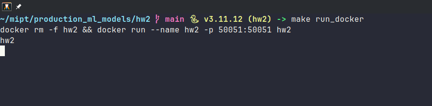
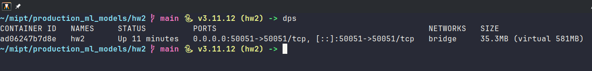
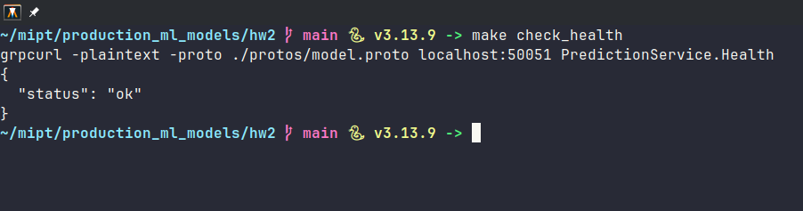
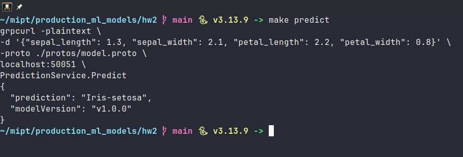

# Домашнее задание № 2

## Цель проекта
Научиться создавать сервисы для полноценного запуска ML модели в продакшене. Научиться запускать такие сервисы что бы модель машинного обучения была полностью функциональной и работала как законченное решение. Описывать и использовать gRPC API для взаимодействием с сервисом.

За основу сервиса, я взял модель `DecisionTreeClassifier`, который я обучал на датасете `iris` для решения задачи классификации цветков ириса из [предыдущего урока](https://github.com/FrankensteinPillow/mlops_hw1_ilia_zubov) по данному предмету.

## Сборка и запуск

### UV
Решение использует современный пакетный менеджер python `uv`. Для дальнейшей работы необходима установка только этой системной зависимости. Для его установки необходимо выполнить следующие команды:
* Windows: `powershell -ExecutionPolicy ByPass -c "irm https://astral.sh/uv/install.ps1 | iex"`
* Linux / MacOS: `curl -LsSf https://astral.sh/uv/install.sh | sh`


### Команды make
Для удобства разработки и тестирования я создал несколько `make` команд которые позволяют быстро собирать docker-контейнер, запускать приложение (как в docker так и локально), форматировать код python, а так же осуществлять запросы по двум gRPC эндпоинтам, представленным в сервисе.

Для ознакомления со списком `make` команд можно посмотреть в файл `Makefile`.

### Сборка приложения
Для сборки контейнера с сервисом:
```bash
make build
```
или
```bash
docker build -t hw2 .
```
Для установки зависимостей сервиса локально (не в docker-контейнере):
```bash
uv sync
```

### Запуск приложения
Для запуска контейнера с сервисом:
```bash
make run_docker
```
или
```bash
docker run --name hw2 -p 50051:50051 hw2
```
Как видно из команды запуска, сервис публикуется на порту 50051 по-умолчанию. Однако порт нужно заменить. Как в этой команде, так и в `Dockerfile` для сборки docker-образа с другим портом.

Если необходимо запустить сервис локально (не в docker-контейнере), то можно воспользоваться следующей командой:
```bash
uv run main.py
```

### Примеры вызовов gRPC эндпоинтов
Для удобства тестирования эндпоинтов я сделал `make` команды:
* `make predict`
* `make check_health`

Однако же можно воспользоваться например консольной утилитой `grpcurl` для обращения к эндпоинтам сервиса напрямую из командной строки.

Пример вызова метода `predict`:
```bash
grpcurl -plaintext \
  -d '{"sepal_length": 1.3, "sepal_width": 2.1, "petal_length": 2.2, "petal_width": 0.8}' \
  -proto ./protos/model.proto \
  localhost:50051 \
  PredictionService.Predict
```
Ответ сервера:
```json
{
  "prediction": "Iris-setosa",
  "modelVersion": "v1.0.0"
}
```
Пример вызова метода `health`:
```bash
grpcurl -plaintext -proto ./protos/model.proto localhost:50051 PredictionService.Health
```
Ответ сервера:
```json
{
  "status": "ok"
}
```

Так же я написал небольшой скрипт для проверки как будет работать python client с данным сервисом. Код клиента находится в файле `client.py`. Его можно запустить и проверить работоспособность сервиса следующим образом:
```bash
uv run client.py
```
Вывод:
```
Prediction: Iris-setosa
```
> Стоит отметить что `gRPC` контракт хранится в файле `protos/model.proto`. При необходимости изменения контракта нужно не забыть запустить перегенерацию `pb`-файлов:
```bash
make generate
```
или полный вариант:
```
python -m grpc_tools.protoc \
	-I ./protos --python_out=server/pb \
	--grpc_python_out=server/pb \
	./protos/model.proto
```

## Снимки экрана с запуском команд
### Запуск docker-контейнера с сервисом в командной строке с использованием команды `make`:


### Проверка что Docker-контейнер запущен и работает


### Проверка состояния сервиса (`Health` эндпоинт):


### Проверка `Predict` эндпоинта с передаваемыми данными:
Используем `grpcurl`


### Проверка использования клиента написанного на python

